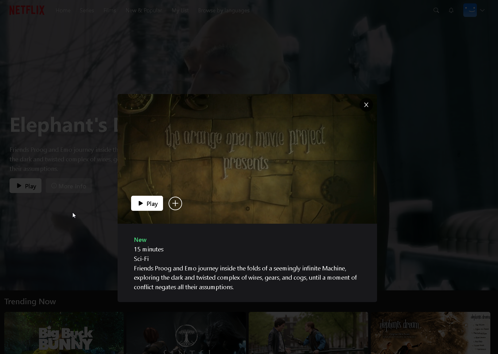
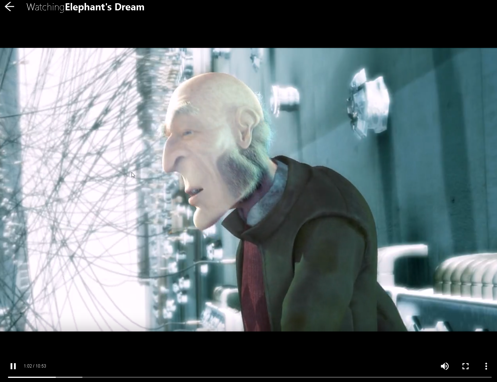
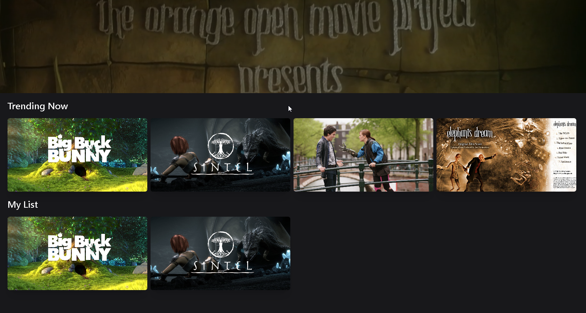
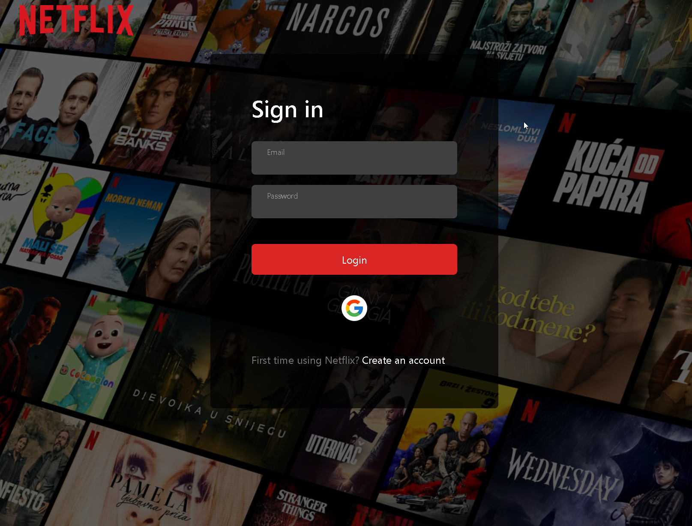
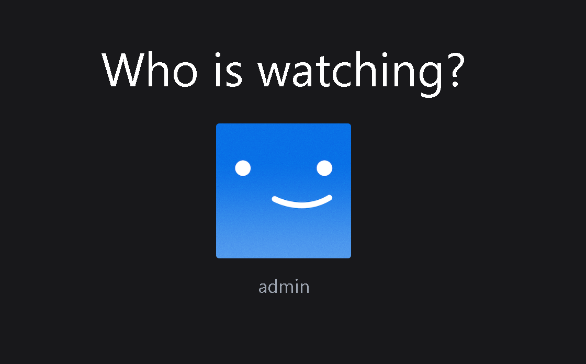

## Introduction

## Movie Player

## Favorites Section

## Login Page (Including Google Authentication)

## Profile Selection

## Netflix Clone

This is a Netflix clone application built with TypeScript and Next.js. It provides a development environment for building a streaming platform with features like MongoDB and Prisma for database management, NextAuth for authentication with Google, and TailwindCSS for responsive and visually appealing UI design. It incorporates cookie-based authentication for secure user sessions and utilizes React SWR for efficient data fetching and caching. State management is handled using Zustand, ensuring seamless data flow and organization.

### Features

- Netflix-like streaming platform
- MongoDB and Prisma for efficient database management
- NextAuth for authentication with Google and Github login support
- Fully responsive design for optimal user experience across devices
- Cookie-based authentication for secure user sessions
- APIs and controllers for data communication and manipulation
- Detailed effects and animations using TailwindCSS
- React SWR for efficient data fetching and caching
- Zustand for state management

### Getting Started

1. Clone the repository:

bash

`git clone https://github.com/your-username/netflix-clone.git`

2. Install dependencies:

bash

`cd netflix-clone npm install`

3. Set up your environment variables. Rename the `.env.example` file to `.env` and fill in the required values.
    
4. Start the development server:
    

bash

`npm run dev`

5. Open your browser and navigate to `http://localhost:3000` to see the application.

