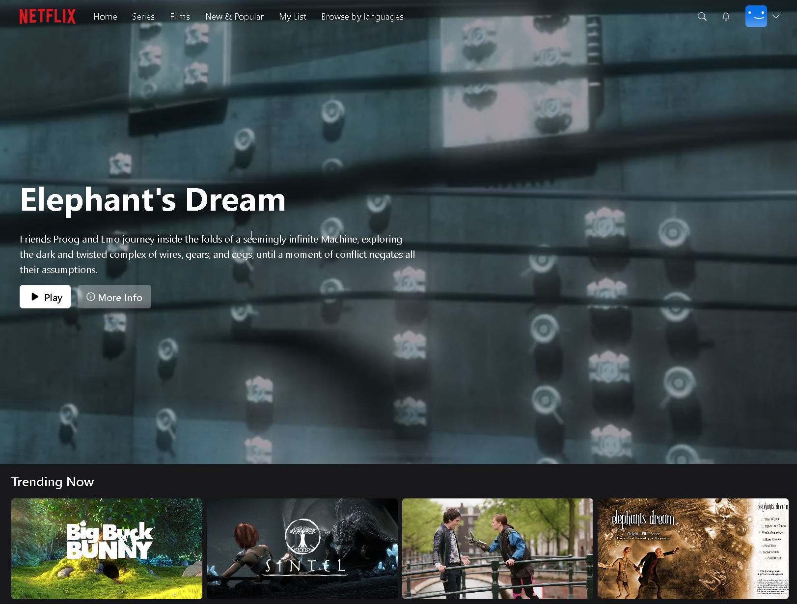

## Introduction

## Movie Player

## Favorites Section

## Login Page (Including Google Authentication)

## Profile Selection

Setting up the development environment with Typescript, and NextJS.
Establishing connections to MongoDB and Prisma for database management.
Implementing authentication functionality using NextAuth, with support for Google and Github login.
Ensuring full responsiveness across all pages for optimal user experience.
Implementing cookie-based authentication for secure user sessions.
Creating APIs and controllers to handle data communication and manipulation.
Incorporating detailed effects and animations using TailwindCSS for a visually appealing interface.
Utilizing React SWR for efficient data fetching and caching.
Implementing Zustand for state management, enabling seamless data flow and organization.
